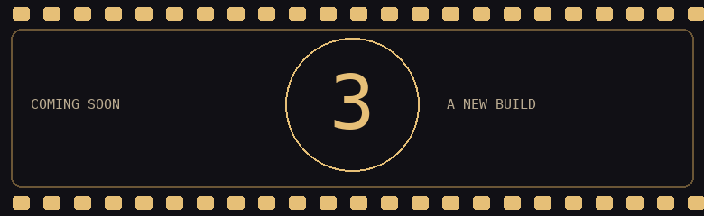
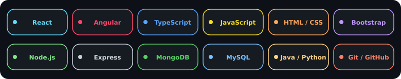

# 🎬 Marco Magdy

### Computer Engineering Student · Full Stack Projects · Cinema Lover

**Turning ideas into applications, one scene at a time.**

Web interfaces · Backend APIs · Database integration

[LinkedIn](https://www.linkedin.com/in/marco-magdy-99a5b82a3/) · [Email](mailto:marcomagdy200@gmail.com) · [Portfolio Source](https://github.com/Marcomagdy908/Portfolio)

---

## 🎞️ Behind the scenes

I'm a Computer and Systems Engineering student at Helwan University, working toward a career in full stack development. My projects span ecommerce, fitness platforms, task management, and Java games.

I enjoy turning ideas into usable applications and improving how their interfaces, APIs, and data work together. Away from code, I love cinema—the stories, the visuals, and the little details that make a scene memorable.

## 🛠️ Director’s toolkit

  

| Area | Technologies |
| --- | --- |
| Frontend | React, Angular, TypeScript, JavaScript, HTML, CSS, Bootstrap |
| Backend | Node.js, Express |
| Databases | MongoDB, MySQL |
| Other development | Java, Python |
| Tools | Git, GitHub, Vite |

## 🎬 What I build

- **Frontend experiences:** responsive interfaces, reusable components, and interactive dashboards.
- **Backend systems:** APIs, authentication flows, and application logic.
- **Data integration:** connecting applications to MongoDB and MySQL.

## 🍿 Now showing — selected projects

| Project | What it does | Stack |
| --- | --- | --- |
| [🍕 Bella Napoli](https://github.com/Marcomagdy908/Food-ecommerce) | Food ordering storefront with pizza customization, checkout, order tracking, and an admin dashboard. | Angular, Node.js, Express, MongoDB |
| [🏋️ Apex Track](https://github.com/Marcomagdy908/fitnessApp) | Fitness platform with workout and diet tracking, trainer bookings, and dashboards for users, trainers, and administrators. | React, TypeScript, Express, MySQL |
| [✅ To-Do List](https://github.com/Marcomagdy908/to-do-list) | Task management interface with local storage and views for today, upcoming, and completed tasks. | React, JavaScript |
| [🎮 2D Game](https://github.com/Marcomagdy908/2d-game) | Team game project featuring movement, combat, levels, scoring, and audio. | Java |

## 🎟️ Let’s create something

Interested in a project or collaboration? Reach me on [LinkedIn](https://www.linkedin.com/in/marco-magdy-99a5b82a3/) or at [marcomagdy200@gmail.com](mailto:marcomagdy200@gmail.com).

---

### When the build works and it’s time for a movie 🍿

Movie GIF: Aquaman Movie via GIPHY

**Code. Create. Roll credits.**

